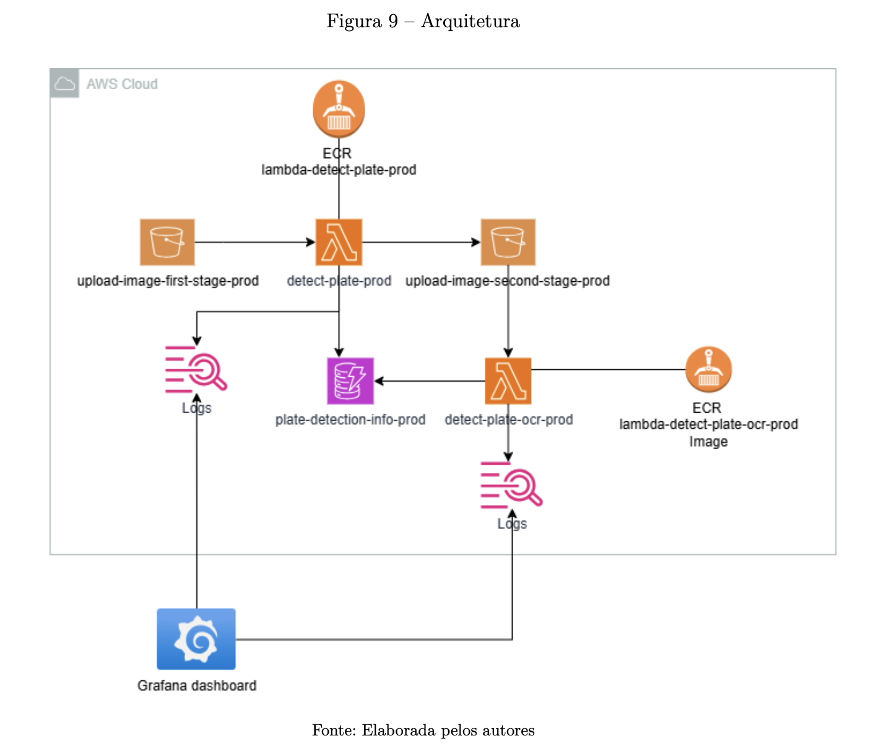
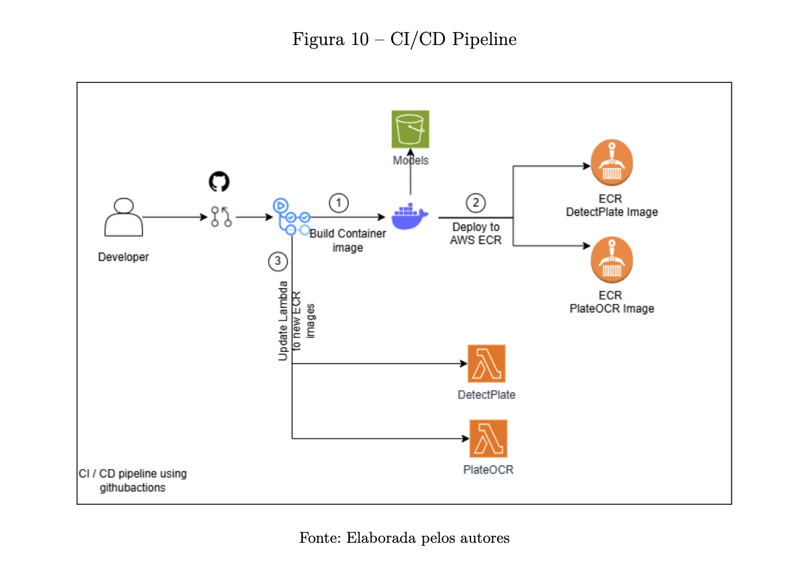

<div align = center>

# :books: Projeto de Detecção e Reconhecimento de Placas de Carro | UFSCAR

[](https://github.com/RogerioLS/TCC_MLOPS_UFSCAR_CAR_PLATE/actions/workflows/build_and_push_ecr.yml)


[](https://github.com/pre-commit/pre-commit)
</div>
Este projeto tem como objetivo detectar placas de carro utilizando o modelo YOLO e, em seguida, reconhecer os caracteres das placas detectadas utilizando o PaddleOCR. A aplicação é desenvolvida em Streamlit, onde as imagens são carregadas e enviadas para um bucket S3. A detecção de placas é realizada por uma função Lambda com YOLO, que extrai a imagem da placa e a coloca em outro bucket S3. Isso aciona uma segunda função Lambda com PaddleOCR para ler os caracteres da placa e registrar todas as informações no DynamoDB.

#### Estrutura do Projeto

```
├── code
│   ├── lambda_detect_plate
│   │   ├── Dockerfile
│   │   └── lambda_function.py
│   ├── lambda_ocr
│   │   ├── Dockerfile
│   │   └── lambda_function.py
│   ├── streamlit
│   │   ├── main.py
│   │   ├── requirements.txt
│   │   └── src
│   │       ├── __init__.py
│   │       ├── dynamo_db.py
│   │       └── s3.py
│   └── utils
│       ├── convert_to_yolo_label.py
│       ├── file_path_treatment.py
│       ├── remane_photo.py
│       ├── test_mlflow_cloud.py
│       └── training_and_test_separation.py
├── jupyter
│   ├── detectando_caracter_placa_ocr.ipynb
│   ├── detectando_placa_Opencv.ipynb
│   ├── detectando_placa_yolo.ipynb
│   └── treinamento_placas_carro.ipynb
└── pre-commit-config.yaml
```
#### Descrição dos Componentes
1. Lambda para Detecção de Placas (**lambda_detect_plate**)
- Dockerfile: Define a imagem Docker para a função Lambda.
- lambda_function.py: Contém a lógica para detectar placas de carro utilizando o modelo YOLO. A imagem da placa detectada é extraída e enviada para outro bucket S3.
2. Lambda para OCR (**lambda_ocr**)
- Dockerfile: Define a imagem Docker para a função Lambda.
- lambda_function.py: Contém a lógica para reconhecer os caracteres das placas utilizando o PaddleOCR. As informações são registradas no DynamoDB.
3. Aplicação Streamlit (**streamlit**)
- main.py: Define a interface do usuário para carregar imagens e iniciar o processo de detecção e reconhecimento de placas.
- requirements.txt: Lista as dependências necessárias para a aplicação Streamlit.
- src:
    - init.py: Inicializa o módulo.
    - dynamo_db.py: Contém a lógica para interagir com o DynamoDB.
    - s3.py: Contém a lógica para interagir com o S3.
4. Utilitários (**utils**)
- convert_to_yolo_label.py: Script para converter rótulos para o formato YOLO.
- file_path_treatment.py: Script para tratamento de caminhos de arquivos.
- remane_photo.py: Script para renomear fotos.
- test_mlflow_cloud.py: Script para testar o MLflow na nuvem.
- training_and_test_separation.py: Script para separar dados de treinamento e teste.
5. Notebooks Jupyter (**jupyter**)
- detectando_caracter_placa_ocr.ipynb: Notebook para detectar caracteres de placas utilizando OCR.
- detectando_placa_Opencv.ipynb: Notebook para detectar placas utilizando OpenCV.
- detectando_placa_yolo.ipynb: Notebook para detectar placas utilizando YOLO.
- treinamento_placas_carro.ipynb: Notebook para treinamento de modelos de detecção de placas de carro.

#### Como Executar o Projeto
**Pré-requisitos**
- Docker
- AWS CLI configurado
- Conta AWS com permissões para Lambda, S3 e DynamoDB

**Passos para Execução**
1. Configurar e iniciar a aplicação Streamlit:
- Navegue até o diretório **streamlit**.
- Instale as dependências:
    - ```pip install -r requirements.txt```
- Execute a aplicação Streamlit:
    - ```streamlit run main.py --server.enableXsrfProtection false```

2. Configurar e implantar as funções Lambda:
- Navegue até os diretórios lambda_detect_plate e lambda_ocr.
- Construa e publique as imagens Docker para o ECR (Elastic Container Registry) da AWS.
- Crie as funções Lambda utilizando as imagens Docker publicadas.

3. Configurar os buckets S3 e DynamoDB:
- Crie os buckets S3 necessários para armazenar as imagens.
- Crie a tabela DynamoDB para armazenar as informações das placas.

4. Utilizar a aplicação:
- Acesse a aplicação Streamlit.
- Carregue uma ou mais imagens de carros.
- As imagens serão enviadas para o bucket S3, acionando a função Lambda para detecção de placas.
- A função Lambda de detecção de placas extrairá a imagem da placa e a enviará para outro bucket S3, acionando a função Lambda de OCR.
- A função Lambda de OCR reconhecerá os caracteres da placa e registrará as informações no DynamoDB.
- Os resultados serão exibidos na interface do usuário da aplicação Streamlit.

#### Arquitetura

---


#### Contribuição
Contribuições são bem-vindas! Sinta-se à vontade para abrir issues e pull requests para melhorias e correções.

#### Pre-commit
Para instalar o Pre-commit, siga os passos abaixo:

1. **Instalar o Pre-commit**:
   - Use o comando `pip` para instalar o Pre-commit:
     ```bash
     pip install pre-commit
     ```

2. **Adicionar o arquivo de configuração `.pre-commit-config.yaml`**:
   - Certifique-se de que o arquivo `.pre-commit-config.yaml` está no diretório raiz do seu repositório.

3. **Instalar os hooks de Pre-commit**:
   - No diretório raiz do seu repositório, execute o seguinte comando para instalar os hooks definidos no arquivo de configuração:
     ```bash
     pre-commit install
     ```
    - Caso precise atualizar o arquivo `.pre-commit-config.yaml` rode:
     ```bash
     pre-commit autoupdate
     pre-commit install
     ```

Para utilizar o Pre-commit, siga os passos abaixo:

1. **Executar os hooks de Pre-commit manualmente (opcional)**:
   - Você pode executar os hooks de Pre-commit manualmente em todos os arquivos do repositório para verificar se há problemas antes de fazer um commit:
     ```bash
     pre-commit run --all-files
     ```

2. **Fazer um commit**:
   - Quando você fizer um commit, os hooks de Pre-commit serão executados automaticamente. Se algum dos hooks falhar, o commit será interrompido e você precisará corrigir os problemas antes de tentar novamente.

#### Licença
Este projeto está licenciado sob a Licença MIT. Veja o arquivo LICENSE para mais detalhes.
